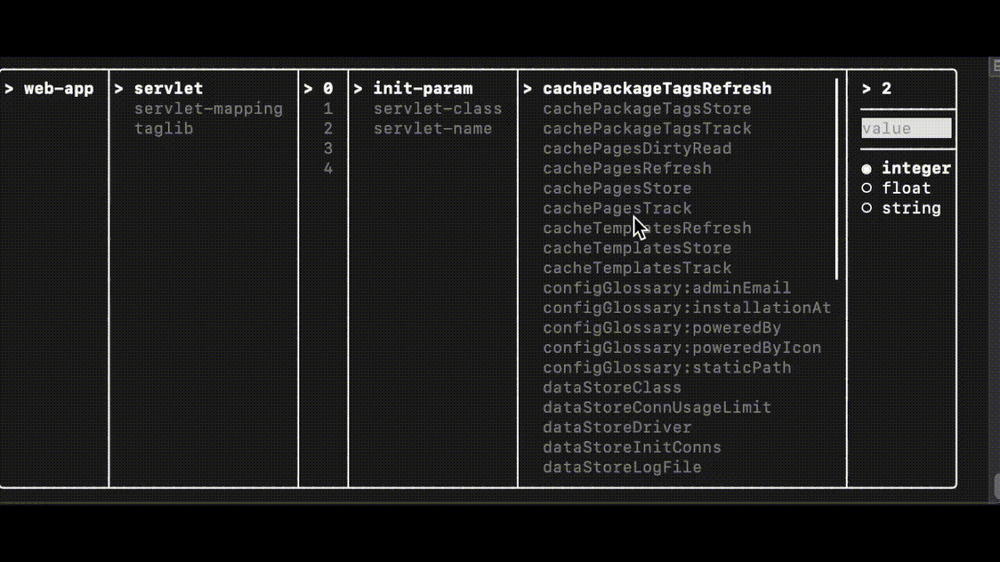

FTXUI - https://github.com/ArthurSonzogni/FTXUI

nlohmann json - https://github.com/nlohmann/json

This work does render .json files and allows you to overwrite it with changed values.
For Linux:

```sh
$ mkdir build
$ cd build
$ cmake ..
$ make 
```

./TUI --flag /path_to_your_file or ./TUI /path_to_your_file

flag can be:
--table(by default)
--navy
--vert-c
--vert-b

